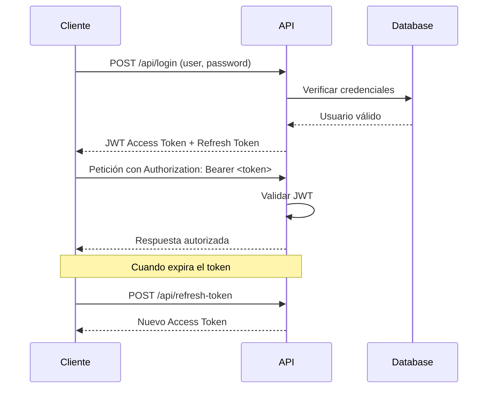

# 🔒 Backend Usuarios - API REST con Go + Gin

Sistema completo de autenticación, gestión de usuarios y sesiones terapéuticas desarrollado en Go. Proporciona APIs REST seguras con autenticación JWT, autenticación biométrica, gestión de roles avanzada y análisis de estadísticas para el ecosistema de análisis de emociones.

## 📋 Tabla de Contenidos
- [🚀 Características](#-características)
- [🏗️ Arquitectura](#%EF%B8%8F-arquitectura)
- [🛠️ Tecnologías](#%EF%B8%8F-tecnologías)
- [⚙️ Instalación](#%EF%B8%8F-instalación)
- [🔧 Configuración](#-configuración)
- [📡 API Endpoints](#-api-endpoints)
- [🔐 Sistema de Autenticación](#-sistema-de-autenticación)
- [👥 Roles y Permisos](#-roles-y-permisos)
- [🏥 Gestión de Pacientes](#-gestión-de-pacientes)
- [📊 Sesiones Terapéuticas](#-sesiones-terapéuticas)
- [🛡️ Seguridad](#%EF%B8%8F-seguridad)
- [🐳 Docker](#-docker)

## 🚀 Características

### 🔐 Autenticación Completa
- **JWT Tokens** con acceso y refresh automático
- **Autenticación biométrica** (WebAuthn/FIDO2)
- **Sistema OTP** para verificación por email/SMS
- **Recuperación de contraseña** segura
- **Rate limiting avanzado** anti-spam
- **Gestión de sesiones** con expiración

### 👥 Gestión de Usuarios
- **CRUD completo** de usuarios
- **Sistema de roles** dinámico (Admin, Terapeuta, Padre)
- **Perfiles de usuario** con fotos y banners
- **Límites configurables** para cambios de perfil
- **Activación/desactivación** de cuentas
- **Búsqueda y filtrado** avanzado

### 🏥 Gestión Médica
- **Pacientes** con información médica completa
- **Sesiones terapéuticas** con programación y seguimiento
- **Sistema de calificaciones de terapeutas** por sesión
- **Estadísticas y métricas** de progreso diferenciadas por rol
- **Relaciones familiares** (terapeuta-paciente-padre)
- **Exportación** de reportes (PDF/JPG)
- **Validaciones médicas** específicas
- **Dashboard dinámico** con estadísticas por rol (Admin/Terapeuta)

### 🛡️ Seguridad Avanzada
- **Rate limiting** personalizable (50/día por usuario)
- **Protección CSRF** y headers de seguridad
- **Validación robusta** de entradas
- **Cifrado** de contraseñas con bcrypt
- **Middleware de autorización** por roles
- **Logs de auditoría** completos

## 🏗️ Arquitectura

### Clean Architecture
```
┌─────────────────────────────────────────────────────────────┐
│                    PRESENTATION LAYER                       │
│  ┌─────────────┐  ┌─────────────┐  ┌─────────────┐          │
│  │ Controllers │  │ Middlewares │  │   Routes    │          │
│  └─────────────┘  └─────────────┘  └─────────────┘          │
└─────────────────────────────────────────────────────────────┘
                              │
┌─────────────────────────────────────────────────────────────┐
│                     BUSINESS LAYER                          │
│  ┌─────────────┐  ┌─────────────┐  ┌─────────────┐          │
│  │  Services   │  │     DTOs    │  │ Validations │          │
│  └─────────────┘  └─────────────┘  └─────────────┘          │
└─────────────────────────────────────────────────────────────┘
                              │
┌─────────────────────────────────────────────────────────────┐
│                      DATA LAYER                             │
│  ┌─────────────┐  ┌─────────────┐  ┌─────────────┐          │
│  │   Models    │  │  Database   │  │   Cache     │          │
│  │   (GORM)    │  │   (MySQL)   │  │  (Redis)    │          │
│  └─────────────┘  └─────────────┘  └─────────────┘          │
└─────────────────────────────────────────────────────────────┘
```

### Estructura del Proyecto
```
backend_usuarios/
├── controllers/           # Controladores HTTP
│   ├── auth_controller.go
│   ├── user_controller.go
│   ├── patient_controller.go
│   ├── therapy_controller.go
│   └── bio_controller.go
├── middlewares/          # Middleware HTTP
│   ├── auth_middleware.go
│   ├── cors_middleware.go
│   └── rate_limiter.go
├── models/              # Modelos de datos (GORM)
│   ├── user.go
│   ├── patient.go
│   ├── therapy_session.go
│   └── biometric.go
├── service/             # Lógica de negocio
│   ├── user_service.go
│   ├── patient_service.go
│   ├── therapy_service.go
│   └── email_service.go
├── dto/                 # Data Transfer Objects
│   ├── auth_dto.go
│   ├── patient_dto.go
│   └── therapy_dto.go
├── routes/              # Definición de rutas
│   └── user_routes.go
├── utils/               # Utilidades
│   ├── jwt.go
│   ├── validation.go
│   └── crypto.go
├── config/              # Configuración
│   └── database.go
├── migrations/          # Migraciones DB
├── public/              # Archivos estáticos
├── main.go              # Punto de entrada
├── go.mod               # Dependencias
├── Dockerfile           # Container Docker
└── .env.example         # Ejemplo de configuración
```

## 🛠️ Tecnologías

### Core Framework
- **Go 1.21+** - Lenguaje base
- **Gin Framework** - Web framework HTTP
- **GORM** - ORM para base de datos
- **MySQL 8.0+** - Base de datos principal

### Autenticación y Seguridad
- **JWT** (golang-jwt/jwt/v4) - Tokens de autenticación
- **WebAuthn** (duo-labs/webauthn) - Autenticación biométrica
- **bcrypt** (golang.org/x/crypto) - Hash de contraseñas
- **CORS** - Cross-Origin Resource Sharing

### Cache y Performance
- **Redis** - Cache y rate limiting
- **Compression** - Compresión HTTP
- **Connection pooling** - Pool de conexiones DB

### Dependencias Principales
```go
require (
    github.com/gin-gonic/gin v1.10.0
    github.com/golang-jwt/jwt/v4 v4.5.0
    github.com/joho/godotenv v1.5.1
    gorm.io/gorm v1.25.12
    gorm.io/driver/mysql v1.5.7
    golang.org/x/crypto v0.26.0
    github.com/duo-labs/webauthn v0.0.0-20220815211337-00c9fb5711f5
    github.com/go-redis/redis/v8 v8.11.5
)
```

## ⚙️ Instalación

### Prerrequisitos
- **Go 1.21+** instalado
- **MySQL 8.0+** funcionando
- **Redis** (opcional, para rate limiting)
- **Git** para clonar el repositorio

### Pasos de Instalación

1. **Clonar el repositorio**
   ```bash
   git clone <repository-url>
   cd backend_usuarios/
   ```

2. **Instalar dependencias**
   ```bash
   go mod download
   go mod tidy
   ```

3. **Configurar base de datos MySQL**
   ```sql
   CREATE DATABASE usuarios_db CHARACTER SET utf8mb4 COLLATE utf8mb4_unicode_ci;
   CREATE USER 'api_user'@'localhost' IDENTIFIED BY 'secure_password';
   GRANT ALL PRIVILEGES ON usuarios_db.* TO 'api_user'@'localhost';
   FLUSH PRIVILEGES;
   ```

4. **Configurar variables de entorno**
   ```bash
   cp .env.example .env
   # Editar .env con tus configuraciones
   ```

5. **Ejecutar migraciones**
   ```bash
   go run main.go migrate
   ```

6. **Ejecutar el servidor**
   ```bash
   # Desarrollo
   go run main.go

   # Producción
   go build -o backend_usuarios
   ./backend_usuarios
   ```

## 🔧 Configuración

### Variables de Entorno (.env)
```bash
# Base de datos MySQL
DB_HOST=localhost
DB_PORT=3306
DB_NAME=usuarios_db
DB_USER=api_user
DB_PASSWORD=secure_password

# Seguridad JWT
JWT_SECRET=mi_secret_super_seguro_2024
JWT_REFRESH_SECRET=mi_refresh_secret_2024

# Servidor HTTP
PORT=8080
GIN_MODE=release
HOST=0.0.0.0

# Redis (Cache y Rate Limiting)
REDIS_HOST=localhost
REDIS_PORT=6379
REDIS_PASSWORD=
REDIS_DB=0

# Rate Limiting
RATE_LIMIT_REQUESTS_PER_DAY=50
RATE_LIMIT_MODULE_LIMIT=20
RATE_LIMIT_MODULE_WINDOW=20m

# Email (Opcional)
SMTP_HOST=smtp.gmail.com
SMTP_PORT=587
SMTP_USER=your-email@gmail.com
SMTP_PASSWORD=your-app-password


# Límites de aplicación
MAX_PATIENTS_PER_THERAPIST=20
MAX_PATIENTS_PER_CAREGIVER=5
MAX_SESSIONS_PER_PATIENT=8
MAX_SESSION_UPDATES=3
```

### Configuración de Desarrollo vs Producción
```bash
# Desarrollo
GIN_MODE=debug
JWT_SECRET=mi_chiquete
LOG_LEVEL=debug

# Producción
GIN_MODE=release
JWT_SECRET=complex_production_secret_256_bits
LOG_LEVEL=info
```

## 📡 API Endpoints

### 🔓 Endpoints Públicos

#### Autenticación
```http
POST   /api/login                      # Autenticación básica
POST   /api/refresh-token              # Renovar JWT token
POST   /otp/validate                   # Validar código OTP
POST   /otp/resend                     # Reenviar OTP
POST   /login/begin                    # Iniciar login biométrico
POST   /login/finish                   # Completar login biométrico

# Recuperación de contraseña
POST   /password/validate-email        # Validar email para cambio
POST   /password/send-otp             # Enviar OTP para cambio
POST   /password/verify-otp           # Verificar OTP
POST   /password/change-with-otp      # Cambiar contraseña con OTP
```

### 🔒 Endpoints Protegidos (Requieren JWT)

#### Gestión de Usuarios
```http
GET    /api/users                     # Listar usuarios (paginado)
POST   /api/register                  # Registrar usuario (admin)
GET    /api/users/search              # Buscar usuarios
GET    /api/users/{id}                # Obtener usuario por ID
PUT    /api/users/{id}                # Actualizar usuario
DELETE /api/users/{id}                # Eliminar usuario (admin)
PATCH  /api/users/{id}/status         # Cambiar estado (admin)
PUT    /api/users/{id}/password       # Cambiar contraseña
```

#### Perfiles de Usuario
```http
GET    /api/profile                   # Perfil del usuario actual
GET    /api/profile/{id}              # Perfil de usuario específico
GET    /api/profile/children          # Hijos del usuario (padres)
PUT    /api/profile/update            # Actualizar perfil
GET    /api/profile/changes           # Límites de cambios restantes

# Gestión de archivos
POST   /api/users/photo               # Subir foto de perfil
GET    /api/users/photo/changes       # Cambios de foto restantes
POST   /api/users/banner              # Subir banner de perfil
GET    /api/users/banner/changes      # Cambios de banner restantes
```

#### Roles y Permisos
```http
GET    /api/roles                     # Listar roles disponibles
POST   /api/roles                     # Crear rol (admin)
PUT    /api/roles/{id}                # Actualizar rol (admin)
DELETE /api/roles/{id}                # Eliminar rol (admin)
```

#### Gestión de Pacientes
```http
GET    /api/patients                  # Listar pacientes (filtrado por rol)
POST   /api/patients                  # Crear paciente
GET    /api/patients/{id}             # Obtener paciente por ID
PUT    /api/patients/{id}             # Actualizar paciente
DELETE /api/patients/{id}             # Eliminar paciente
GET    /api/patients/{id}/stats       # Estadísticas del paciente
```

#### Sesiones Terapéuticas
```http
GET    /api/sessions                  # Listar sesiones
POST   /api/sessions                  # Crear sesión terapéutica
GET    /api/sessions/paginated        # Sesiones paginadas
GET    /api/sessions/latest-patients  # Últimos 3 pacientes
GET    /api/sessions/available-therapists # Terapeutas disponibles
GET    /api/sessions/{id}             # Detalle de sesión
PUT    /api/sessions/{id}             # Actualizar sesión
PATCH  /api/sessions/{id}/reschedule  # Reprogramar sesión
DELETE /api/sessions/{id}             # Eliminar sesión

# Exportación
GET    /api/sessions/{id}/export/pdf  # Exportar sesión a PDF
GET    /api/sessions/{id}/export/jpg  # Exportar sesión a JPG

# Sistema de Calificaciones de Terapeutas 🆕
POST   /api/therapist-ratings         # Crear calificación de terapeuta
GET    /api/therapist-ratings/{therapist_id} # Obtener calificaciones de terapeuta
GET    /api/sessions/rating/{session_id}     # Verificar calificación de sesión existente
```


### 📊 Parámetros de Consulta

#### Paginación (Usuarios y Pacientes)
```http
GET /api/users?page=1&per_page=20&search=juan&active=true&role_id=2&order_by=created_at&order_direction=desc
GET /api/patients?page=1&limit=10&search=maria
```

#### Filtros de Sesiones
```http
GET /api/sessions/paginated?page=1&limit=5&search=terapia&estado=programada&patient_id=123
```

## 🔐 Sistema de Autenticación

### Flujo de Autenticación JWT


### Estructura del JWT Token
```json
{
  "header": {
    "alg": "HS256",
    "typ": "JWT"
  },
  "payload": {
    "user_id": 123,
    "roles": "TR,PD",
    "email": "usuario@example.com",
    "exp": 1695123456,
    "iat": 1695120000
  }
}
```


## 👥 Roles y Permisos

### Sistema de Roles Jerárquico

#### 🛡️ Administrador (AD)
```go
Permisos Completos:
✅ Gestión de usuarios (CRUD completo)
✅ Gestión de roles y permisos
✅ Acceso a todos los pacientes
✅ Gestión de todas las sesiones terapéuticas
✅ Calificación de terapeutas (en nombre de cualquier cuidador) 🆕
✅ Visualización de todas las calificaciones existentes 🆕
✅ Dashboard con estadísticas globales del sistema 🆕
✅ Configuración del sistema
✅ Exportación de reportes
✅ Gestión de dispositivos biométricos
✅ Acceso a logs y auditoría
```

#### 👨‍⚕️ Terapeuta (TR)
```go
Permisos Especializados:
✅ Gestión de pacientes asignados
✅ Creación y gestión de sesiones terapéuticas
✅ Visualización de calificaciones recibidas 🆕
✅ Dashboard con estadísticas de pacientes propios 🆕
✅ Acceso a estadísticas de pacientes
✅ Exportación de reportes de sesiones
✅ Gestión de objetivos terapéuticos
✅ Asignación de pacientes a padres
```

#### 👨‍👩‍👧‍👦 Padres/Cuidadores (PD)
```go
Permisos Limitados:
✅ Vista de pacientes asignados (hijos)
✅ Seguimiento de progreso de hijos
✅ Vista de sesiones programadas
✅ Calificación de terapeutas tras sesiones completadas 🆕
✅ Visualización de calificaciones propias realizadas 🆕
✅ Acceso a estadísticas básicas
✅ Actualización de perfil propio

```

### Validación de Permisos


### Encriptación
```go
// Contraseñas
bcrypt.GenerateFromPassword([]byte(password), bcrypt.DefaultCost)

// Datos sensibles en base de datos
AES256-GCM para campos críticos

// Tokens JWT
HMAC-SHA256 con secret rotativo
```


## 🆕 Nuevas Funcionalidades Implementadas

### Sistema de Calificaciones de Terapeutas
- **Calificación por sesión**: Los cuidadores pueden calificar terapeutas del 1-5 estrellas tras cada sesión completada
- **Comentarios opcionales**: Posibilidad de agregar comentarios a las calificaciones
- **Verificación automática**: El sistema verifica si una sesión ya fue calificada para prevenir duplicados
- **Visualización dinámica**: Las calificaciones se muestran automáticamente en la interfaz
- **Permisos por rol**: Los administradores pueden calificar en nombre de cualquier cuidador

### Sistema de Reasignación Automática de Terapeutas 🆕
- **Detección de calificaciones bajas**: Cuando un terapeuta recibe una calificación de 1-3 estrellas, el sistema activa automáticamente el proceso de reasignación
- **Búsqueda inteligente de terapeutas**: Encuentra un nuevo terapeuta disponible que cumpla con los criterios:
  - No sea el terapeuta actual
  - No esté descalificado (menos de 20 malas calificaciones)
  - Tenga menos de 20 pacientes asignados
  - Esté activo en el sistema
- **Reasignación automática de sesiones**:
  - Actualiza todas las sesiones futuras con estado "programada" al nuevo terapeuta
  - Actualiza el terapeuta predeterminado del paciente
  - Guarda el ID del nuevo terapeuta en la sesión calificada para referencia histórica
- **Creación automática de sesiones de seguimiento**:
  - Si no hay sesiones futuras programadas, crea automáticamente una nueva sesión
  - Programa la sesión 8 días hábiles después de la calificación (excluyendo fines de semana)
  - Configura la sesión con objetivos predefinidos: "Evaluación inicial con nuevo terapeuta", "Establecer rapport", "Definir plan de tratamiento"
  - Duración estándar: 60 minutos (10:00 AM - 11:00 AM)
- **Cálculo de días hábiles**: Algoritmo que excluye sábados y domingos para programación precisa
- **Sistema de descalificación**: Contador de malas calificaciones por terapeuta con eliminación automática tras 20 calificaciones bajas
- **Notificaciones automáticas**: Envío de emails a cuidadores y nuevo terapeuta asignado (funcionalidad preparada)
- **Logs detallados**: Registro completo del proceso de reasignación para auditoría y debugging

### Dashboard Diferenciado por Rol
- **Estadísticas de Administrador**: Vista global con total de terapeutas, pacientes, sesiones y calificaciones
- **Estadísticas de Terapeuta**: Vista personalizada con pacientes propios, sesiones programadas y calificaciones recibidas
- **Carga dinámica**: Las estadísticas se cargan según el rol del usuario autenticado

### Navegación Administrativa Completa
- **Flujo completo**: Admin → Cuidadores → Pacientes → Sesiones → Calificar
- **Filtrado inteligente**: Sesiones filtradas por paciente específico
- **Botón dinámico**: Estado del botón de calificación se actualiza automáticamente según si la sesión ya fue calificada

### Mejoras en la API
- **Endpoint de verificación**: `GET /api/sessions/rating/{session_id}` para verificar calificaciones existentes
- **Control de permisos mejorado**: Validación específica por rol para calificaciones
- **Resolución de conflictos**: Rutas optimizadas para evitar conflictos en Gin Router

## 🐛 Correcciones Recientes

### Búsqueda de Terapeutas Corregida
- **Problema**: El sistema no encontraba terapeutas disponibles al crear sesiones
- **Causa**: Las consultas SQL buscaban por nombre de rol 'TR' cuando la BD usaba IDs numéricos
- **Solución**: Cambio de `WHERE UPPER(roles.name) = 'TR'` a `WHERE roles.id = 4` en `therapy_service.go`

### Lógica de Estado Activo/Inactivo
- **Problema**: Estados invertidos en la interfaz de usuario
- **Causa**: La BD usa convención inversa (0=activo, 1=inactivo)
- **Solución**: Inversión de lógica booleana en los repositorios de Android

### Visualización de Fotos Base64
- **Problema**: Las fotos de usuarios no se mostraban correctamente
- **Causa**: Las imágenes venían con prefijo "data:image/jpeg;base64,"
- **Solución**: Eliminación automática del prefijo antes de decodificar en los adapters

---


#DESARROLLADO POR JHAFET CÁNEPA  , ACTUALIZADO OCTUBRE - 2025